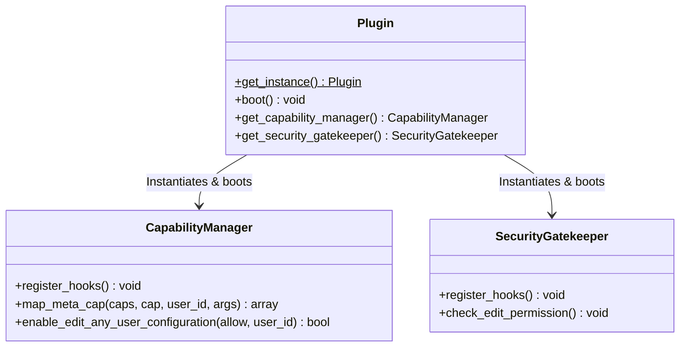

# Multisite Subsite Admin User Editor (Edit Only)

A premium, highly secure, and extensible WordPress Multisite plugin that allows subsite administrators to **edit only** users belonging to their respective subsites. They are strictly prohibited from creating, deleting, or adding users, and Super Admin accounts are fully protected.

---

## 🌟 Key Features
- **Edit-Only restriction:** Subsite admins can edit existing subsite users but cannot create, add, or delete users.
- **Super Admin Protection:** Restricts any subsite admin from viewing, editing, or modifying network Super Admin profiles.
- **Subsite Isolation:** Limits subsite admins to editing users who belong to the same subsite (blog).
- **Core-Level Capability Mapping:** Uses the low-level `map_meta_cap` hook to intercept permissions at the core, protecting all interfaces (including POST requests, REST API, AJAX, and CLI).
- **Early Security Termination:** Patches security bypass vulnerabilities in similar plugins by intercepting admin screen loads early (`load-user-edit.php`) before form updates can process.

---

## 🏗️ Technical Architecture

This plugin uses a clean, object-oriented design patterns compliant with modern PSR-4 conventions.



### Components
1. **[multisite-subsite-admin-user-editor.php](file:///C:/Users/vanpa/OneDrive/Documents/github/wordpress-plugins/multisite-subsite-admin-user-editor/multisite-subsite-admin-user-editor.php):** Bootstrapper. Declares standard WP headers and registers a fallback PSR-4 autoloader that maps PascalCase namespaces to standard WordPress `class-{slug}.php` structures.
2. **[includes/class-plugin.php](file:///C:/Users/vanpa/OneDrive/Documents/github/wordpress-plugins/multisite-subsite-admin-user-editor/includes/class-plugin.php):** Main class (Singleton) that orchestrates services, checking if the environment is a WordPress Multisite instance.
3. **[includes/class-capability-manager.php](file:///C:/Users/vanpa/OneDrive/Documents/github/wordpress-plugins/multisite-subsite-admin-user-editor/includes/class-capability-manager.php):** Intercepts low-level WordPress capabilities. It overrides `edit_user` checks, performs security evaluations, and blocks `delete_*` and `create_*` capability requests.
4. **[includes/class-security-gatekeeper.php](file:///C:/Users/vanpa/OneDrive/Documents/github/wordpress-plugins/multisite-subsite-admin-user-editor/includes/class-security-gatekeeper.php):** High-level security shield on admin dashboard controllers. Intercepts screen loading before POST requests or render cycles execute.

---

## 🔒 Security Fixes Over Standard Implementation

In typical snippets found online (such as the one this was adapted from), security validation is done during the `admin_head` hook. This has a major vulnerability:

> [!WARNING]
> **The `admin_head` Vulnerability:**
> In WordPress, user update POST requests are processed in `wp-admin/user-edit.php` **before** the page header or `admin_head` hook runs. If a subsite admin posts malicious modifications to a user they shouldn't edit, the update completes, database rows change, and only *afterward* does `admin_head` trigger a `wp_die()`. The attacker successfully mutates the user despite the warning.

### Our Solution
1. **Lower-Level Filtering:** We handle permissions in `map_meta_cap`, which filters `$current_user_can('edit_user')` queries universally.
2. **Pre-Processing Interception:** We hook screen access checks into `load-user-edit.php`. This executes early in the controller bootstrap lifecycle, shutting down unauthorized POST requests before the database is touched.

---

## 🔌 Extensibility: Custom Hooks & Filters

Developers can customize the plugin's behavior using the following WordPress hooks:

### Filters

#### 1. `ms_user_editor_allowed_caps`
Customize which meta-capabilities are mapped to permit subsite admin editing.
- **Default:** `['edit_user', 'edit_users']`
- **Example Usage:**
```php
add_filter( 'ms_user_editor_allowed_caps', function( $caps ) {
    $caps[] = 'edit_custom_user_meta';
    return $caps;
} );
```

#### 2. `ms_user_editor_blocked_caps`
Explicitly define capabilities that are strictly forbidden for subsite administrators (resulting in `['do_not_allow']`).
- **Default:** `['delete_user', 'delete_users', 'create_users', 'add_users']`

#### 3. `ms_user_editor_is_editable`
Perform fine-grained authorization checks when checking if a user is editable.
- **Arguments:** `$is_editable` (bool), `$target_user_id` (int), `$editor_user_id` (int), `$blog_id` (int)
- **Example Usage:**
```php
add_filter( 'ms_user_editor_is_editable', function( $is_editable, $target_user_id, $editor_user_id ) {
    // Example: Do not allow subsite admins to edit users with the 'administrator' role
    if ( user_can( $target_user_id, 'administrator' ) ) {
        return false;
    }
    return $is_editable;
}, 10, 3 );
```

### Actions

#### 1. `ms_user_editor_before_edit_permission_check`
Fires right before security validation occurs. Useful for audit trails or logging.
- **Arguments:** `$editor_id` (int), `$target_user_id` (int), `$blog_id` (int)

---

## 🧪 Testing and Quality Assurance

The plugin includes PHPUnit unit tests that verify all authorization pathways without requiring a database connection, utilizing `WP_Mock`.

### 1. Install Testing Dependencies
Ensure you have Composer installed, open a terminal in the plugin folder, and run:
```bash
composer install
```

### 2. Run the Test Suite
Run the tests using vendor PHPUnit:
```bash
vendor/bin/phpunit
```

The tests cover:
- **Capability Mapping:** Ensures Super Admin access is bypassed, forbidden actions (deletes/adds) fail, cross-subsite edits fail, and valid subsite edits succeed.
- **Security Gates:** Confirms that screen-loading controllers throw permission failures and stop request flow when boundaries are crossed.
